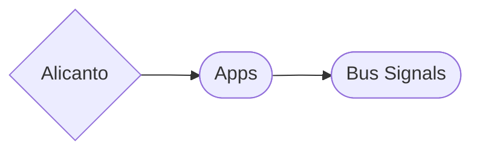

# Alicanto Backend.

Backend de telemetria de buses electricos, el cual tiene por objetivo servir en a ambas plataformas, la plataforma de uso interno con un set de señales mas amplio y la plataforma que ocupara Link 


## Tech Stack.
- Python
- Django
- React
- Django Restframework
- MySql
- AWS
   - RDS
   - EC2
   - S3
   - Lambda

## Django Structure.


## Aplicacion Bus.
- Modelos.
  - Bus.     
  - Battery24Volts.
  - Soc.
  - PackTemperature.
  - MaxTemperaturePack.
  - BatteryHealth.
  - BatteryPackCurrent.
  - BatteryPackVoltage.
  - BatteryPackCellMaxVoltage.
  - BatteryPackCellMinVoltage.
  - BatteryPackAvgCellVoltage.
  - Isolation.
  - PtcOneVoltage.
  - PtcTwoVoltage.
  - PositiveTorque.
  - NegativeTorque
  - EngineTemperature.
  - LenzeCurrent.
  - LenzeEngineSpeed.
  - Odometer.
  - Speed.
  - SystemPressure.
  - BtmsTemperature.
  - FusiCode.
  - ChargeStatus.
  - GearStatus.
  - BusState.
  - BrakePedalStatus.
  - AirConditionerStatus.
  - ServiceCompressorStatus.
  - BtmsStatus.
  - FusiMessage.
  - MarkVersion.
  - JarvisVersion.
  - ModemInfo.


## Run Locally

Clone the project

```bash
  git clone https://github.com/Reborn-Telemetry/Alicanto-Backend.git
```

Install dependencies

```bash
  pip install -r requirements.txt
```

Start the server

```bash
  python3 manage.py runserver
```


## Authors

- [@hurbx](https://github.com/hurbx)


